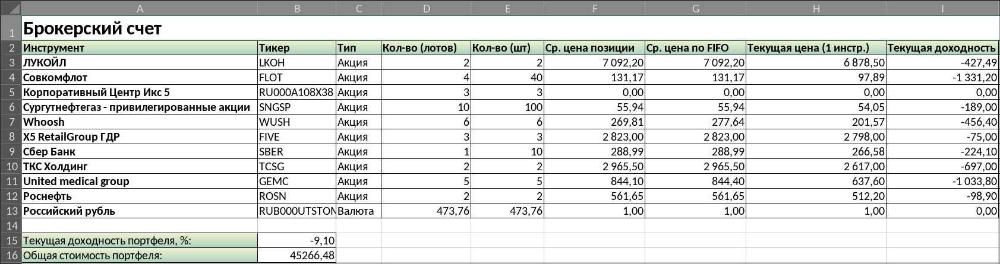
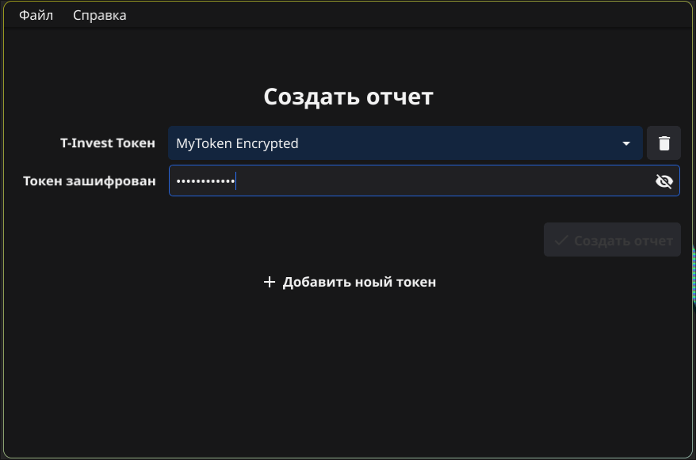
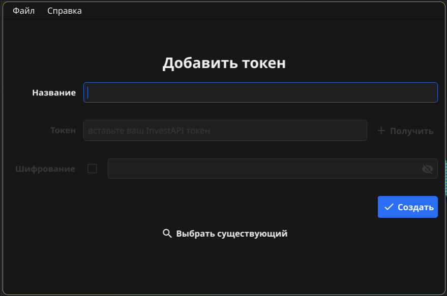

# TReport

## Описание

Программа с графическим интерфейсом для создания отчетов
по вашим инвестиционным портфелям на платформе **T-Invest**.

  
Внешний вид экрана создания отчета

  

  
Внешний вид экрана добавления токена

  

### T-Invest API

Для формирования отчетов используется **T-Invest API**, а именно методы:

- **GetPortfolio** сервиса _Операций_
- **GetInstrumentBy** сервиса _Инструментов_
- **GetAccounts** сервиса _Счетов_

Подробнее ознакомиться с **T-Invest API** и его _методами_ можно на [сайте документации](https://russianinvestments.github.io/investAPI/).

### Особенности

- Программа написана на языке **Go** с использованием библиотеки графического
интерфейса **Fyne**.
- Для T-Invest API использован официальный SDK: [invest-api-go-sdk](https://github.com/RussianInvestments/invest-api-go-sdk)
- Для хранения токенов-доступа к **T-Invest API** использована БД **SQLite**.
- Архитектура приложения основана на **Domain Driven Design** подходе.

## Использование

1. Запустите приложение и перейдите на **экран добавления _токена-доступа_**
к _T-Invest API._ \
    Этот экран скорее всего отобразится у вас автоматически, если
ранее вы не добавили токены.

2. **Добавьте существующий токен**, или создайте новый на сайте платформы T-Invest. \
    **Опционально**, для предотвращению несанкционированного доступа к вашим
токенам (в случае доступа к компьютеру) добавьте _парольную защиту._

3. Далее **перейдите на экран создания отчета**, и при необходимости,
введите пароль, а затем нажмите кнопку "Создать".
Выберите папку, где будет создан Excel документ с отчетом. \
    После успешного создания, **файл будет автоматически открыт**
вашим приложением для просмотра документов по умолчанию.
Либо откройте его самостоятельно.

## Ручная сборка приложения

Для сборки приложения понадобиться:

- **Go**-компилятор
- **Docker**
- пакет для сборки **fyne-cross**

В общем случае, примерный путь для самостоятельно сборки выглядит следующим образом:

1. Клонировать этот репозиторий
2. Удовлетворить все зависимости `go mod tidy`
3. Запустить `makecross.sh`

В результате, при успехе, в директории **./fyne-cross** будут созданы пакеты
для **windows**, **linux**, и **darwin** (macOS)

Для пакета MacOS требуются дополнительные SDK (X-Code)
